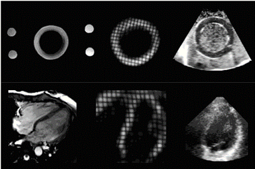
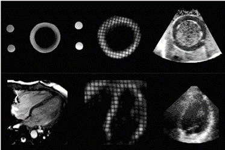
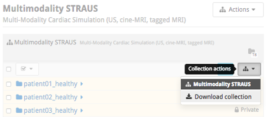
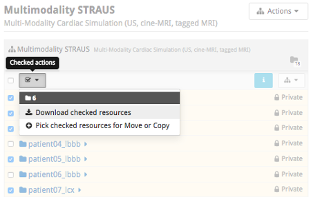

# Human Heart Dataset

众所周知，中国幅员辽阔，架设的互联网在不同的地方质量大不相同，有些地方很容易受到 DNS 污染，因此在下载某些数据集的过程中并不是很顺畅。于是有了这个想法，将费尽时间下载的数据集提供 GitHub 或者国内常用网盘的下载方式，及其原网页介绍。

目前仅有两个心脏的数据集

| 名称                                                         | 简介                                                         | 内容                                                         | 国内网盘下载 | GitHub下载 |
| ------------------------------------------------------------ | :----------------------------------------------------------- | :----------------------------------------------------------- | :----------- | ---------- |
| **Cardiac Atlas Project** [Motion Tracking Challenge](#head3) | 这项挑战的目的是评估应用于多模态心脏数据库的不同运动分析算法的准确性和可重复性。 | cine SSFP sequences 4D tMR 3D ultrasound           | 待上传       | 待上传     |
| **Human Heart Project** [Multimodal straus database](#head3) | 提出了第一个模拟框架，该框架允许从同一虚拟病人中生成逼真的三维合成心脏超声和磁共振（包括cine和tagged）图像序列。 | 3D cine-MR simulation sequences 3D tag-MR (ch1 & ch2 & ch3) simulation sequences ) 3D Ultrasound simulation sequences | 待上传       | 待上传     |

# [Cardiac Atlas Project](http://www.cardiacatlas.org/)

## head3[Motion Tracking Challenge（运动追踪挑战）](http://www.cardiacatlas.org/challenges/motion-tracking-challenge/)

This is the first Cardiac Motion Analysis Challenge that was held at the 2011 MICCAI workshop entitled “Statistical Atlases and Computational Models of the Heart: Imaging and Modelling Challenges” (STACOM’11). The objective of this challenge is to evaluate the accuracy and reproducibility of different motion analysis algorithms applied to a multimodal cardiac database. The database includes a dataset from a dynamic phantom1 and 15 datasets from healthy volunteers. The data was acquired at the Division of Imaging Sciences and Biomedical Engineering, King’s College London, United Kingdom, and the Department of Internal Medicine II – Cardiology, University of Ulm, Germany.（这是第一届心脏运动分析挑战赛，是在2011年MICCAI研讨会上举行的，题为 "心脏的统计图谱和计算模型。影像和建模的挑战"（STACOM'11）。这项挑战的目的是评估应用于多模态心脏数据库的不同运动分析算法的准确性和可重复性。该数据库包括一个动态模型1的数据集和15个健康志愿者的数据集。这些数据是在英国伦敦国王学院影像科学和生物医学工程系以及德国乌尔姆大学内科二系--心脏科获得的。）

Click [here](http://cilab2.upf.edu/stacom_cesc11/index.php?option=com_content&view=article&id=24&Itemid=22) for more information about the motion tracking challenge.

### Data

The Cardiac Atlas Project hosts the challenge data. Each case consists of cardiac MRI and 3D ultrasound images. The MR acquisition includes: (1) cine SSFP sequences in 2-chamber, 4-chamber, and short-axis views, (2) a whole-heart SSFP sequence gated at end-diastole and end-expiration; and (3) a 4D tMR sequence2. Sequences including three orthogonal tagged directions will be provided together with a fused grid-tagged volume sequence, in VTK and NIFTI formats. The ultrasound acquisition includes a 4D apical volume acquisition. All the datasets will be provided in anonymized DICOM format. （The Cardiac Atlas Project托管了这些挑战数据。每个案例由心脏MRI和三维超声图像组成。磁共振采集包括 (1)两腔、四腔和短轴视图的cine SSFP序列；(2)在舒张末期和呼气末期门控的全心SSFP序列；以及(3)4D tMR序列2。将以VTK和NIFTI格式提供包括三个正交标记方向的序列，以及融合网格标记的体积序列。超声采集包括4D心尖容积采集。所有的数据集都将以匿名的DICOM格式提供。）

The data are provided with open access policy by attributation. This means that if you publish a paper using these data, then you are requested to cite the following citation:（这些数据是根据开放存取政策提供的。这意味着，如果你使用这些数据发表论文，那么你需要引用以下引文）

C. Tobon-Gomez, M. De Craene, K. McLeod, L. Tautz, W. Shi, A. Hennemuth, A. Prakosa, H. Wang, G. Carr-White, S. Kapetanakis, A. Lutz, V. Rasche, T. Schaeffter, C. Butakoff, O. Friman, T. Mansi, M. Sermesant, X. Zhuang, S. Ourselin, H.-O. Peitgen, X. Pennec, R. Razavi, D. Rueckert, A. F. Frangi, and K. S. Rhode, “[Benchmarking framework for myocardial tracking and deformation algorithms: An open access database](http://dx.doi.org/10.1016/j.media.2013.03.008),” *Med Image Anal*, 17(6), 632–648, 2013.

| No.  | File                                                         | Size     |
| ---- | ------------------------------------------------------------ | -------- |
| 1.   | [phantom.zip](http://www.cardiacatlas.org/files/MOTION-STACOM2011/phantom.zip) | 290.8 MB |
| 2.   | [v1.zip](http://www.cardiacatlas.org/files/MOTION-STACOM2011/v1.zip) | 396.6 MB |
| 3.   | [v2.zip](http://www.cardiacatlas.org/files/MOTION-STACOM2011/v2.zip) | 454.7 MB |
| 4.   | [v4.zip](http://www.cardiacatlas.org/files/MOTION-STACOM2011/v4.zip) | 394.1 MB |
| 5.   | [v5.zip](http://www.cardiacatlas.org/files/MOTION-STACOM2011/v5.zip) | 390.2 MB |
| 6.   | [v6.zip](http://www.cardiacatlas.org/files/MOTION-STACOM2011/v6.zip) | 387.1 MB |
| 7.   | [v7.zip](http://www.cardiacatlas.org/files/MOTION-STACOM2011/v7.zip) | 489.1 MB |
| 8.   | [v8.zip](http://www.cardiacatlas.org/files/MOTION-STACOM2011/v8.zip) | 472.5 MB |
| 9.   | [v9.zip](http://www.cardiacatlas.org/files/MOTION-STACOM2011/v9.zip) | 448.8 MB |
| 10.  | [v10.zip](http://www.cardiacatlas.org/files/MOTION-STACOM2011/v10.zip) | 409.9 MB |
| 11.  | [v11.zip](http://www.cardiacatlas.org/files/MOTION-STACOM2011/v11.zip) | 491.9 MB |
| 12.  | [v12.zip](http://www.cardiacatlas.org/files/MOTION-STACOM2011/v12.zip) | 395.8 MB |
| 13.  | [v13.zip](http://www.cardiacatlas.org/files/MOTION-STACOM2011/v13.zip) | 581.3 MB |
| 14.  | [v14.zip](http://www.cardiacatlas.org/files/MOTION-STACOM2011/v14.zip) | 461.9 MB |
| 15.  | [v15.zip](http://www.cardiacatlas.org/files/MOTION-STACOM2011/v15.zip) | 317.2 MB |
| 16.  | [v16.zip](http://www.cardiacatlas.org/files/MOTION-STACOM2011/v16.zip) | 399.3 MB |

### Ground truth

The ground truth data of this challenge is available: [cMac.zip](http://www.cardiacatlas.org/files/MOTION-STACOM2011/cMAC.zip) (363.5 MB)

### Additional files

- [Readme.pdf](http://www.cardiacatlas.org/wp-content/uploads/sites/2/2015/12/readme.pdf)
- [Short axis cine tag registration sheet data](http://www.cardiacatlas.org/wp-content/uploads/sites/2/2015/12/SA_cine_tag_registration.xls) (XLS)
- [The presentation of motion challenge data](http://www.cardiacatlas.org/files/MOTION-STACOM2011/Motion_Challenge.pptx) (PPTX)

### Contacts

For more inquiries about the data, please contact

- Kawal Rhode (kawal.rhode@kcl.ac.uk)
- Catalina Tobon Gomez (catactg@gmail.com)
- Mathieu de Craene (mathieu.de_craene@philips.com)

# Human Heart Project

## Multimodality STRAUS

This is a joint venture between [Philips Research Suresnes FRANCE](http://www.philips.com/a-w/research/locations/suresnes.html), [CREATIS](http://www.creatis.insa-lyon.fr/) and [INRIA (Team ASCLEPIOS)](https://team.inria.fr/asclepios/).

## Overview

Quantification of cardiac deformation and strain through different image modalities (3D ultrasound and magnetic resonance imaging being the most widely used techniques) has been the object of intense research. However, a widespread use of these techniques in clinical routine is still held back due to the lack of strong studies which accuratly quantify and compare the performance of existing methods in each modality. The use of synthetic sequences is one of the most promising tool for advanced initial in silico evaluation. Nevertheless, the realism of existing simulation techniques still needs to be improved to represent reliable benchmarking data.

### Objectives

We propose in this study the first simulation framework which allows the generation of realistic 3D synthetic cardiac ultrasound and magnetic resonance (both cine and tagged) image sequences from the same virtual patient.

### Methodology

A state-of-the-art electromechanical model is combined with physical simulators (one for each modality) in an novel framework which efficiently merges several warping strategies to keep full control of myocardial deformations while preserving realistic image texture. The novelties introduced in this paper are the following :

- The combination of an electromechanical model with a magnetic resonance physical simulator to introduce the possibility of interacting with the image formation process to introduce complex effects;
- The use of multi-modal template sequences from the same patient to extract the most relevant information from each modality in order to generate both cine and tagged synthetic sequences;
- The introduction of a novel combinative warping strategy, with the goal of reducing motion artifacts that may occur in myocardial regions;
- The contribution of the first unified framework which allows the generation of multi-modal (US, cine and tagged MR) realistic synthetic sequences for the same virtual patient.

A schematic of the extended pipeline to magnetic resonnance simulation is summarized hereunder

## Open-access database

The proposed generic framework was used to generate the first database composed of 3D ultrasound, cine and tagged MR sequences for each of the 18 virtual patients, including healthy and pathological cases. We simulated a total of 90 sequences representing 2700 image volumes.

All the simulations were launched from the [virtual imaging platform](https://vip.creatis.insa-lyon.fr/) (VIP) which allows the execution of the simulator as a web service and benefits from the [EGI](https://www.egi.eu/) computing power. The generation of one full 3D sequence took around 6 hours on VIP, knowing that would have taken over 300 hours on a personal laptop

### Get Started

To browse through the image database, simply connect to the [Multimodality STRAUS database](http://humanheart-project.creatis.insa-lyon.fr/database/#collection/587de6f4e1af3f30a2980a58), explore and download the images of interest or the entire collection. This database is public, so no login is required.

### Download

You can download the entire collection of images or specific images.

#### Download Collection (Option 1)

Click on the icon menu ***Collection actions*** in the upper-right of the collection's header and select ***Download collection***\.

Collection actions menu.

#### Download Collection (Option 2)

Click on the icon ***Collection actions*** in the upper-right corner of the table's header and ***Download collection***.

Collection actions icon.

#### Download Selected Folders

Select the folders of interest and click on the icon ***Checked actions*** and ***Download checked resources***.

Checked actions icon.

Each virtual patient folder is organized as follows

| Folder | Content Description                                          |
| ------ | ------------------------------------------------------------ |
| cine   | 3D cine-MR simulation sequences (raw/mhd) with reference meshes (vtk) |
| tag1   | 3D tag-MR (ch1) simulation sequences (raw/mhd) with reference meshes (vtk) |
| tag2   | 3D tag-MR (ch2) simulation sequences (raw/mhd) with reference meshes (vtk) |
| tag3   | 3D tag-MR (ch3) sequences (raw/mhd) with reference meshes (vtk) |
| us     | 3D Ultrasound simulation sequences (raw/mhd) with reference meshes (vtk) |

## R&D Team

| Olivier BERNARD       | Associate Professor, [CREATIS, France](https://www.creatis.insa-lyon.fr/)Contact: [olivier.bernard@creatis.insa-lyon.fr](mailto:olivier.bernard@creatis.insa-lyon.fr) |
| --------------------- | ------------------------------------------------------------ |
| Mathieu De Craene     | Research Engineer, [Philips Research, Suresnes, France](http://www.philips.com/a-w/research/locations/suresnes.html)Contact: [mathieu.decraene@philips.com](mailto:mathieu.decraene@philips.com) |
| Maxime Sermesant      | Researcher, [INRIA, France](https://team.inria.fr/asclepios/)Contact: [maxime.sermesant@inria.fr](mailto:maxime.sermesant@inria.fr) |
| Jan D'hooge           | Professor, [MIRC laboratory, Belgium](http://www.kuleuven.be/wieiswie/en/person/00014531)Contact: [jan.dhooge@uzleuven.be](mailto:jan.dhooge@uzleuven.be) |
| Sorina Camarasu-Pop   | Research Engineer, [CREATIS, France](http://www.creatis.insa-lyon.fr/)Contact: [sorina.pop@creatis.insa-lyon.fr](mailto:sorina.pop@creatis.insa-lyon.fr) |
| Martino Alessandrini  | Postdoctoral fellow, [University of Bologna, Italy](http://www.creatis.insa-lyon.fr/)Contact: [martino.alessandrini@gmail.com](mailto:sorina.pop@creatis.insa-lyon.fr) |
| Denis Friboulet       | Professor, [CREATIS, France](https://www.creatis.insa-lyon.fr/)Contact: [denis.friboulet@creatis.insa-lyon.fr](mailto:denis.friboulet@creatis.insa-lyon.fr) |
| Yitian Zhou           | PhD student, [Philips Research, Suresnes, France](http://www.philips.com/a-w/research/locations/suresnes.html)Contact: [yitian.zhou@philips.com](mailto:yitian.zhou@philips.com) |
| Sophie Giffard-Roisin | PhD student, [INRIA, France](https://team.inria.fr/asclepios/)Contact: [sophie.giffard-roisin@inria.fr](mailto:sophie.giffard-roisin@inria.fr) |
